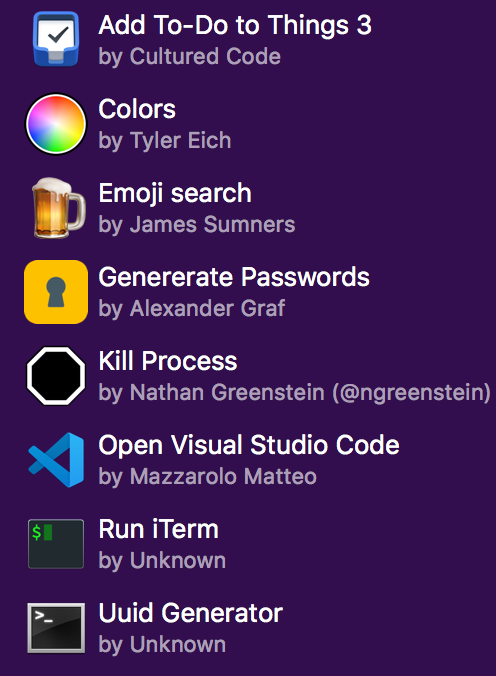

# OSX settings
## Alfred



## Audio settings
### Mac Ear Control (control the Mac music using the headphones controls)  
https://github.com/7hil/mac_ear_control

### Spotify mini-player
https://tma02.github.io/baritone/

## Mouse settings
### SmoothScroll


### SteerMouse


### Still missing:
- A Linux/Windows like experience with the MX Master

## Keyboard settings
### OSX Keyboard settings 


### Keyboard Maestro


### Still missing:
- A decent version of Karabiner for Sierra
- `§` to ` on Macbook keyboard
- Tab switcher (CMD + TAB) for Chrome tabs (et similia)

# VSCode settings
```javascript
{
    "editor.fontFamily": "Monaco",
    "editor.fontSize": 13,
    "editor.tabSize": 2,
    "editor.rulers": [80],
    "javascript.validate.enable": false,
    "files.associations": {
        "*.jsx": "javascript"
    },
    "flow.path": "node_modules/flow-bin/vendor/flow",
    "eslint.autoFixOnSave": true,
    "terminal.integrated.fontFamily": "Monaco",
    "terminal.integrated.fontSize": 12,
    "search.exclude": {
      "**/node_modules": true,
      "**/bower_components": true,
      "**/build": true,
      "**/ios": true,
      "**/android": true
    },
    "color-highlight.markerType": "underline",
    "editor.snippetSuggestions": "bottom",
    "editor.wordBasedSuggestions": false
  }
